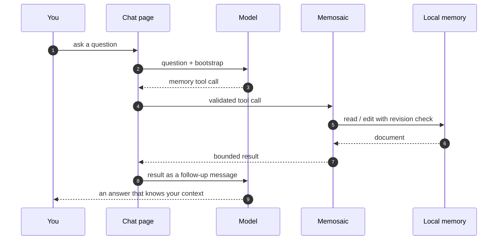

<div align="center">

**English** · [简体中文](README.zh-CN.md)

<br>


# Memosaic

### One memory. Every AI chat. Yours.

[](https://github.com/FlashingChen/memosaic/actions/workflows/ci.yml)
[](https://github.com/FlashingChen/memosaic/releases)
[](LICENSE)


<sub>Local-first · No account · No server · No telemetry</sub>

</div>

---

## The problem

You have already explained yourself. Your stack, your conventions, how you like answers written, what you are building and why.

Then you opened a different AI chat, and it knew none of it.

Every assistant keeps its own memory — or none at all. The memory features that do exist are per-vendor, server-side, opaque, and impossible to edit. So you explain again. And the context you carefully built in one tool never reaches the next one. Six chats later you are still the only one holding the thread.

## The fix

**Memosaic keeps one Markdown document that you own, and lets every supported chat read from it and write to it.**

It lives in your browser profile — not on a server, not in a vendor's database. Exactly two narrow tools are exposed to the page, `read_memory` and `edit_memory`. Teach something to DeepSeek, and Gemini can use it in the next conversation.

> **Your memory shouldn't live in someone else's database.**

## How it works

Web chat pages expose no provider-independent tool-calling API, so Memosaic builds the bridge in the conversation itself. On the first submitted message of a conversation, the adapter appends a short bootstrap — containing none of your memory — that tells the model when to ask for it and how to wrap the request. Validated calls go to the extension's service worker, which executes the local operation and hands back a bounded result, which the page sends as a follow-up message.



Provider-specific concerns stay in their adapters — route detection, composer and send-button discovery, response candidates, user-message exclusion, new-chat reset. The shared controller contains no provider hostnames, routes, or selectors.

## At a glance

| | |
| --- | --- |
| **What it is** | Chrome/Chromium extension, Manifest V3 |
| **Memory** | One editable Markdown document, stored in IndexedDB in your browser profile |
| **Exposed to models** | `read_memory`, `edit_memory` — and nothing else |
| **Permissions** | `storage` only · no host permissions · no remote API · no shell or file access |
| **Languages** | English and Simplified Chinese, for both the UI and the injected instruction |
| **Providers** | DeepSeek, Gemini, Xiaomi MiMo Studio |

## Supported providers

| Provider | Host | Status |
| --- | --- | --- |
| DeepSeek | `chat.deepseek.com` | Supported |
| Gemini | `gemini.google.com` | Supported |
| Xiaomi MiMo Studio | `aistudio.xiaomimimo.com` | Supported |

Adding a provider is the main contribution path: copy [`src/adapters/_template.js`](src/adapters/_template.js), implement the contract, register the host. See the [adapter guide](docs/adapters.md).

## Install

Memosaic is not on the Chrome Web Store yet, so it installs as an unpacked extension. The store listing is planned; the release already produces the exact archive the store accepts.

**From a release** (recommended)

1. Download `memosaic-<version>.zip` from [Releases](https://github.com/FlashingChen/memosaic/releases) and verify it against the published `.sha256`.
2. Unzip it into a folder **you will keep** — Chrome loads the extension from that path on every start, so moving or deleting it breaks the install.
3. Open `chrome://extensions`, enable **Developer mode**, choose **Load unpacked**, and select the folder containing `manifest.json`.
4. Open the Memosaic popup → **Open memory editor**, and write down whatever you want every chat to know.

**From a clone** (for development)

Point **Load unpacked** at this repository — `manifest.json` sits at the root — and hit reload after each edit. It loads your working tree, including uncommitted changes.

Both paths are the same extension; there is no build step.

## Using it day to day

Once the memory editor has content, just chat normally. The model decides when context is relevant, requests it, and gets it back mid-conversation. Edits made by a model are validated and revision-checked before they touch your document, and every edit is recorded so you can see what changed.

The language setting in the popup or editor controls both the extension UI and the wording of the instruction injected into chat.

<details>
<summary><b>Storage, revisions, and safety</b></summary>

<br>

Memory and the latest 50 edit records are stored in IndexedDB inside the extension's browser profile. Memosaic migrates an existing `cross-ai-memory` database into the `memosaic` database the first time the updated extension opens.

Successful model or manual edits increment the revision. Each model edit supplies `base_revision`; replace and delete operations must match one unique substring. Transactions serialize concurrent edits and reject stale revisions.

The protocol never evaluates code, expressions, regular expressions, or file paths. The parser is not a trust boundary either — everything outside the wrapper is discarded unevaluated, and the payload is validated field by field in the store.

</details>

<details>
<summary><b>Language support</b></summary>

<br>

The runtime picks a locale in this order: the language saved in `chrome.storage.local`, the browser language when the setting is `auto`, then English as the fallback. Built-in locales are `en` and `zh-CN`.

To add one, add its messages in [`src/shared/i18n.js`](src/shared/i18n.js), add it to `SUPPORTED_LOCALES`, and add an option to `popup.html` and `memory.html`. Missing keys fall back to English. Prompt localization is part of the feature: the model instruction must be translated, not only the UI.

</details>

## Development

Requires Node.js 20 or newer. There is no compile step — the repository is the extension.

```bash
npm run check     # syntax-check the browser scripts
npm test          # provider, route, protocol, extraction, and i18n coverage
npm run package   # build dist/memosaic-<version>.zip
```

`npm run package` selects the runtime files, validates that the tag, `manifest.json`, and `package.json` agree, and writes the archive with `manifest.json` at its root — the layout both `chrome://extensions` and the Chrome Web Store expect — plus a `.sha256` checksum. `tests/`, `docs/`, and the contributor-only template are excluded.

<details>
<summary><b>Project structure</b></summary>

<br>

```text
src/
  adapters/            one file per provider, plus a template
    _template.js       copy this to add a provider
    deepseek.js  gemini.js  mimo.js  registry.js
  content/
    runtime.js         shared DOM and controller loop
  shared/
    i18n.js            UI and prompt translations
    protocol.js        tool markers and parser
    providers.js       provider metadata
  memory-store.js      IndexedDB storage and revisions
  memory-page.js       local editor
  service-worker.js    background tool execution
  popup.js
tests/                 node --test suites and DOM fixtures
scripts/
  package.mjs               builds the installable bundle
  sync-manifest-version.mjs keeps the manifest version in sync
docs/
  architecture.md  adapters.md
.github/workflows/
  ci.yml                    check, test, and package on every change
  release.yml               build and publish a release from a tag
```

</details>

<details>
<summary><b>Releasing</b></summary>

<br>

Releases are built by GitHub Actions. [`.github/workflows/release.yml`](.github/workflows/release.yml) runs on any `v*` tag push and publishes a GitHub release with the extension zip and its checksum attached.

The tag, `manifest.json`, and `package.json` must carry the same version, and `npm version` keeps them aligned:

```bash
npm version patch          # or minor / major
git push --follow-tags
```

`npm version` bumps `package.json`, runs the `version` lifecycle script that copies the number into `manifest.json`, commits both, and creates the matching tag. The workflow then refuses malformed tags, confirms the tagged commit is reachable from the default branch, runs `npm run check` and `npm test`, builds the bundle with `npm run package -- --version <tag version>` — which fails if the tag and the manifests disagree — and creates the release.

`workflow_dispatch` runs the same pipeline for an existing tag, which is how to republish after a failed job.

Chrome's version syntax takes one to four dot-separated integers and no prerelease suffix, so `v0.3.0-rc.1` is rejected; use `v0.3.0` or a build like `v0.3.0.1`.

</details>

## Contributing

Provider adapters are the main contribution path — AI chat pages change often, so adapter fixes are always welcome. Read [CONTRIBUTING.md](CONTRIBUTING.md) and the [adapter guide](docs/adapters.md).

Please never include session tokens, cookies, private chat text, or personal memory excerpts in issues or commits.

## License

MIT. See [LICENSE](LICENSE).

<div align="center">
<sub>

**Memosaic** — *memory* + *mosaic*: each conversation sees the same picture you own,<br>
instead of making you explain yourself again and again.

Previously prototyped as **CAM / Cross-AI Memory**.

</sub>
</div>
