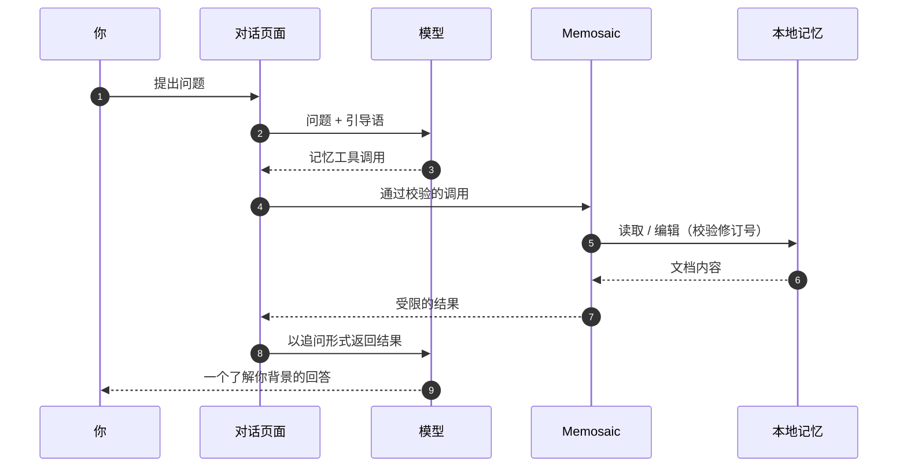

<div align="center">

[English](README.md) · **简体中文**

<br>


# Memosaic

### 一份记忆，通用所有 AI 对话，且完全属于你。

[](https://github.com/FlashingChen/memosaic/actions/workflows/ci.yml)
[](https://github.com/FlashingChen/memosaic/releases)
[](LICENSE)


<sub>本地优先 · 无需账号 · 不经服务器 · 无遥测</sub>

</div>

---

## 问题

你早就把自己介绍过一遍了。你的技术栈、你的约定、你希望答案怎么组织、你正在做什么、为什么这么做。

然后你打开了另一个 AI 对话，而它对此一无所知。

每个助手都只维护自己的记忆——或者根本没有记忆。少数提供记忆功能的产品，也是各平台各自为政、存在服务器端、不透明，而且无法编辑。于是你只能再解释一遍。你在某一个工具里辛苦积累的上下文，永远传不到下一个工具。聊了六个窗口之后，唯一还记得来龙去脉的人，仍然只有你自己。

## 解决方案

**Memosaic 只维护一份属于你的 Markdown 文档，让所有受支持的对话页面都能读取和写入它。**

它存放在你的浏览器配置目录里——不在服务器上，也不在任何厂商的数据库中。暴露给页面的工具只有两个：`read_memory` 和 `edit_memory`。你教给 DeepSeek 的内容，Gemini 在下一次对话中就能用上。

> **你的记忆，不应该存放在别人的数据库里。**

## 工作原理

网页版对话并不向扩展程序提供跨平台统一的工具调用接口，所以 Memosaic 把这座桥搭在对话本身里。在一段对话的第一条消息发出时，适配器会附加一段简短的引导语——其中不含你的任何记忆内容——用来告诉模型：什么时候该索取记忆，以及如何包裹这次请求。通过校验的调用会被送到扩展程序的 Service Worker，在本地完成操作后返回一个受限的结果，页面再把它作为一条追问消息发出去。



与平台相关的部分都留在各自的适配器里——路由识别、输入框与发送按钮的定位、候选回复、用户消息排除、新对话重置检测。共享控制器中不含任何平台域名、路由或选择器。

## 一目了然

| | |
| --- | --- |
| **形态** | Chrome / Chromium 扩展程序，Manifest V3 |
| **记忆载体** | 一份可编辑的 Markdown 文档，存放在浏览器配置目录的 IndexedDB 中 |
| **暴露给模型** | 仅 `read_memory`、`edit_memory` 两个工具 |
| **权限** | 仅 `storage` · 无主机权限 · 无远程接口 · 无 Shell 与文件访问 |
| **语言** | 英文与简体中文，界面和注入模型的指令同步切换 |
| **支持平台** | DeepSeek、Gemini、小米 MiMo Studio |

## 支持的平台

| 平台 | 域名 | 状态 |
| --- | --- | --- |
| DeepSeek | `chat.deepseek.com` | 已支持 |
| Gemini | `gemini.google.com` | 已支持 |
| 小米 MiMo Studio | `aistudio.xiaomimimo.com` | 已支持 |

新增平台是最主要的贡献方式：复制 [`src/adapters/_template.js`](src/adapters/_template.js)，实现适配器约定，注册域名即可。详见[适配器指南](docs/adapters.md)。

## 安装

Memosaic 目前尚未上架 Chrome 应用商店，因此以「已解压的扩展程序」方式安装。上架已在计划中；发布流程产出的压缩包，正是应用商店接受的那一种。

**从 Release 安装**（推荐）

1. 在 [Releases](https://github.com/FlashingChen/memosaic/releases) 下载 `memosaic-<版本号>.zip`，并用同目录下发布的 `.sha256` 校验。
2. 解压到一个**你会长期保留**的文件夹——Chrome 每次启动都会从该路径加载扩展，移动或删除它都会导致安装失效。
3. 打开 `chrome://extensions`，开启右上角的**开发者模式**，点击**加载已解压的扩展程序**，选择包含 `manifest.json` 的那个文件夹。
4. 打开 Memosaic 弹窗 → **打开记忆编辑器**，写下你希望每次对话都了解的内容。

**从源码克隆安装**（用于开发）

直接把**加载已解压的扩展程序**指向本仓库即可（`manifest.json` 就在仓库根目录），改完代码点一下重新加载就能生效。注意这会加载你的工作区，包括尚未提交的改动。

两种方式得到的是同一个扩展，没有构建步骤。

## 日常使用

记忆编辑器里有内容之后，正常聊天就行。模型会自行判断何时需要上下文，主动索取，并在对话中途拿到结果。模型做出的修改在写入文档前都会经过字段校验和修订号检查，每一次编辑也都有记录，你可以随时查看改了什么。

弹窗或编辑器里的语言设置，会同时控制扩展界面和注入对话的指令措辞。

<details>
<summary><b>存储、修订与安全性</b></summary>

<br>

记忆内容和最近 50 条编辑记录存放在扩展程序的 IndexedDB 中。更新后的扩展首次启动时，会把原有的 `cross-ai-memory` 数据库迁移到新的 `memosaic` 数据库。

来自模型或手动的成功编辑都会让修订号递增。每次模型编辑都要带上 `base_revision`；替换和删除操作必须唯一匹配到一段子串。事务会把并发编辑串行化，并拒绝过期的修订号。

协议不会执行代码、表达式、正则或文件路径。解析器本身也不作为信任边界——包装标记之外的内容一律丢弃、不做求值，载荷仍会在存储层逐字段校验。

</details>

<details>
<summary><b>多语言支持</b></summary>

<br>

运行时的语言选择顺序是：`chrome.storage.local` 中保存的语言 → 设置为 `auto` 时的浏览器语言 → 英文兜底。内置语言为 `en` 与 `zh-CN`。

要新增语言，请在 [`src/shared/i18n.js`](src/shared/i18n.js) 中补上文案，加入 `SUPPORTED_LOCALES`，并在 `popup.html` 和 `memory.html` 中添加选项。缺失的键会回退到英文。指令的本地化同样属于功能的一部分：需要翻译的不只是界面，还有注入模型的那段指令。

</details>

## 开发

需要 Node.js 20 或更高版本。没有编译步骤——仓库本身就是扩展程序。

```bash
npm run check     # 对浏览器脚本做语法检查
npm test          # 覆盖平台注册、路由、协议、回复提取与多语言
npm run package   # 生成 dist/memosaic-<版本号>.zip
```

`npm run package` 会挑选运行时文件，校验标签、`manifest.json` 与 `package.json` 的版本是否一致，并生成以 `manifest.json` 为根目录的压缩包——这正是 `chrome://extensions` 与 Chrome 应用商店都要求的结构——同时输出 `.sha256` 校验值。`tests/`、`docs/` 以及仅供贡献者使用的模板不会被打包。

<details>
<summary><b>项目结构</b></summary>

<br>

```text
src/
  adapters/            每个平台一个文件，外加一个模板
    _template.js       复制它来新增平台
    deepseek.js  gemini.js  mimo.js  registry.js
  content/
    runtime.js         共享的 DOM 与控制器循环
  shared/
    i18n.js            界面与指令文案
    protocol.js        工具标记与解析器
    providers.js       平台元数据
  memory-store.js      IndexedDB 存储与修订
  memory-page.js       本地编辑器
  service-worker.js    后台工具执行
  popup.js
tests/                 node --test 测试与 DOM 测试夹具
scripts/
  package.mjs               构建可安装的压缩包
  sync-manifest-version.mjs 保持清单版本号同步
docs/
  architecture.md  adapters.md
.github/workflows/
  ci.yml                    每次改动都做检查、测试与打包
  release.yml               由标签触发构建并发布 Release
```

</details>

<details>
<summary><b>发布流程</b></summary>

<br>

Release 由 GitHub Actions 构建。[`.github/workflows/release.yml`](.github/workflows/release.yml) 会在推送任何 `v*` 标签时运行，并发布一个附带扩展压缩包与校验值的 GitHub Release。

标签、`manifest.json` 与 `package.json` 三者的版本号必须一致，`npm version` 会自动保持同步：

```bash
npm version patch          # 也可以是 minor / major
git push --follow-tags
```

`npm version` 会提升 `package.json` 的版本，触发 `version` 生命周期脚本把版本号写入 `manifest.json`，将两者一起提交，并创建对应的标签。随后工作流会拒绝格式不合法的标签、确认被打标签的提交位于默认分支上、运行 `npm run check` 与 `npm test`、用 `npm run package -- --version <标签版本>` 构建压缩包（标签与两个清单不一致时即失败），最后创建 Release。

`workflow_dispatch` 会对已存在的标签重跑同一套流程，这是在任务失败后重新发布的方式。

Chrome 的版本号语法只接受 1 到 4 段以点分隔的数字，不接受预发布后缀，因此 `v0.3.0-rc.1` 会被拒绝；请改用 `v0.3.0`，或像 `v0.3.0.1` 这样的构建号。

</details>

## 参与贡献

最主要的贡献方向是适配器——AI 对话页面经常改版，适配器的修复永远受欢迎。请先阅读 [CONTRIBUTING.md](CONTRIBUTING.md) 与[适配器指南](docs/adapters.md)。

请勿在 issue 或提交中包含会话令牌、Cookie、私人聊天内容或个人记忆片段。

## 许可证

MIT，详见 [LICENSE](LICENSE)。

<div align="center">
<sub>

**Memosaic** —— *memory* + *mosaic*：每段对话看到的是同一幅由你拥有的画面，<br>
而不是让你一次又一次地重新介绍自己。

早期原型名为 **CAM / Cross-AI Memory**。

</sub>
</div>
